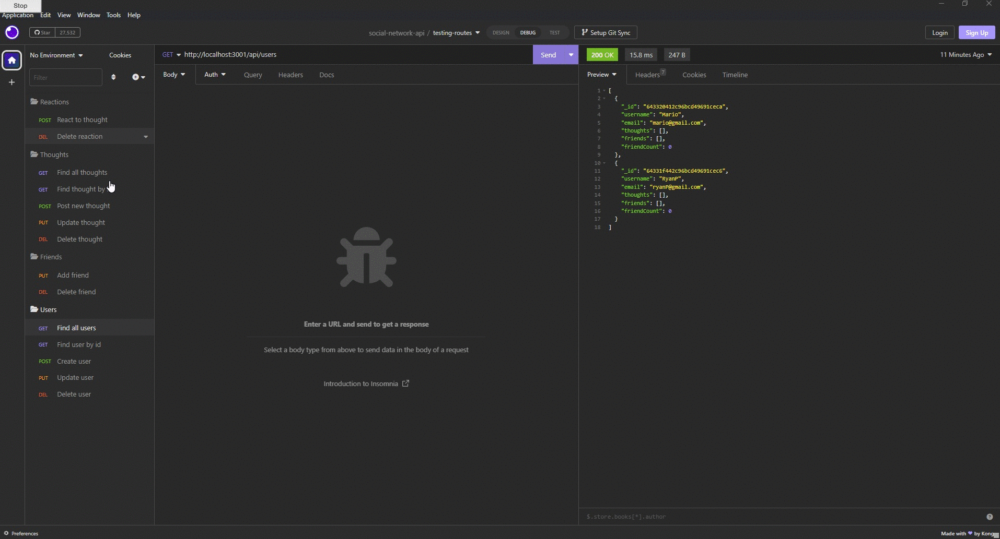

# social-network-api

[](https://opensource.org/licenses/MIT)

## Table of Contents
* [Description](#description)
* [Installation](#installation)
* [Screenshot](#screenshot)
* [Video](#video)
* [Usage](#usage)
* [Licenses](#license)
* [Questions](#questions)
* [Credits](#credits)

## Description
This is a back end application for a social-network. This application uses express.js API and MongooseDB to store database information. API routes are used to perform RESTful CRUD operations.

## Installation
- This app requires Node.js, Express.js, MongooseDB and Insomnia to test routes.
- Start by cloning this repository to your local machine `git clone`. Run ```npm install``` for dependencies.
- Once everything has been installed use ```npm start``` to start the app on ```http://localhost:3001```.
- Now that the server is up and running, open Insomnia to test routes!

## Screenshot


## Video
https://user-images.githubusercontent.com/115953057/230803272-610eeab6-eb5b-4c58-bd7c-cbfb7e2e87c9.mp4

## Usage
This app demostrates the back end application of a social network. allowing users to create/update/delete posts, add and delete friends, and react to other users thoughts.

## Licenses
This project is covered under the MIT license. click the license button at the top to learn more.

https://opensource.org/licenses/MIT

## Questions
Questions regarding this project?
GitHub: https://github.com/Ryebread5555
Email: rypetty55@gmail.com

## Credits
- JavaScript
- NodeJS
- Express.js
- MongooseDB
- Moment js
- Insomnia
